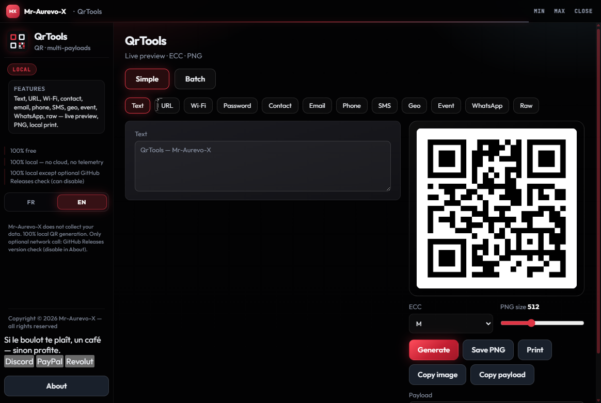

# QrTools

**[Download QrTools.exe](https://github.com/Mr-Aurevo-X/QrTools/releases/latest/download/QrTools.exe)** · **[All releases](https://github.com/Mr-Aurevo-X/QrTools/releases)**

> Direct Windows binary (latest). Open [Releases](https://github.com/Mr-Aurevo-X/QrTools/releases) if the right-sidebar "Releases" link is scrolled away — downloads are **not** under "Tags".

**© 2026 Mr-Aurevo-X — QrTools — 100% local — free — updates not guaranteed**

Générateur de QR codes multi-payloads — 100 % local, 100 % gratuit.  
Multi-payload QR generator — 100% local, 100% free.


## Capture d'écran / Screenshot



## Download / Téléchargement

- **One-click:** [QrTools.exe](https://github.com/Mr-Aurevo-X/QrTools/releases/latest/download/QrTools.exe)
- **Release notes / all versions:** [github.com/Mr-Aurevo-X/QrTools/releases](https://github.com/Mr-Aurevo-X/QrTools/releases)

Double-cliquer sur `QrTools.exe` pour lancer (pas d'installation).  
Double-click `QrTools.exe` to run (no install).

Windows peut afficher « potentiellement dangereux » : les binaires ne sont pas signés Authenticode (pas de certificat éditeur payant). C’est un avertissement de réputation SmartScreen, pas un verdict antivirus.  
Windows may flag the app as potentially unsafe: binaries are not Authenticode-signed (no paid publisher certificate). That is a SmartScreen reputation warning, not an antivirus verdict.

Local SoT (standalone Windows, **not** in PC Command hubs):

`C:\Users\aurel\Documents\Dev Central Tree\03_Standalones\QrTools`

## Legal / Légal

| FR | EN |
|:--|:--|
| **100 % gratuit** | **100% free** |
| **100 % local** — aucun cloud, aucune télémétrie | **100% local** — no cloud, no telemetry |
| **Mise à jour non garantie** — pas d’obligation / pas de SLA ; l’app *peut* vérifier GitHub Releases et proposer une màj | **Updates not guaranteed** — no obligation / no SLA; the app *can* check GitHub Releases and offer an update |
| **Copyright © 2026 Mr-Aurevo-X** — tous droits réservés | **Copyright © 2026 Mr-Aurevo-X** — all rights reserved |

Licence : **proprietary / all rights reserved** (voir `LICENSE`).  
Redistribution, reverse engineering ou suppression des mentions de copyright **interdits** sans accord écrit.  
Aligné avec les CGU Suite Mr-Aurevo-X (`MrAurevoX-UI/legal/`).

Le binaire PyInstaller (`QrTools.exe`) est windowed ; redistribution des sources/exe sans accord écrit interdite.

## Lancer (exe primary)

**Double-clic `QrTools.exe`** — lancement principal, sans flash CMD.

```powershell
cd "C:\Users\aurel\Documents\Dev Central Tree\03_Standalones\QrTools"
# After Build.cmd:
.\QrTools.exe
```

| Fichier | Usage |
|:--|:--|
| `QrTools.exe` | **Principal** — binaire windowed (après `Build.cmd`) |
| `Lancer.bat` / `QrTools.bat` | Si `QrTools.exe` est présent → `start` l’exe puis exit ; sinon fallback `pythonw` détaché |
| `Lancer.cmd` | Même logique (alias optionnel — **pas** enregistré dans PC Command) |

Dev / sans exe :

```powershell
python -m venv .venv
.\.venv\Scripts\pip install -r requirements.txt
.\Lancer.bat
```

## Version & mises à jour (optionnel)

- Fichier version : `VERSION` à la racine (ex. `1.0.1`) — à bumper à chaque release.
- Au démarrage, vérif. **non bloquante** de  
  `https://api.github.com/repos/Mr-Aurevo-X/QrTools/releases/latest`
- Si le tag release est plus récent :
  - **mode exe (frozen)** → asset GitHub `QrTools.exe` (ou zip le contenant) → remplace + relance
  - **mode sources** → `git pull` (clone) ou zipball sources GitHub
- Mode auto : `%LOCALAPPDATA%\Mr-Aurevo-X\QrTools-settings.json` → `"autoUpdate": true`
- Seul appel réseau optionnel : vérif. de version GitHub Releases (désactivable dans **À propos**). Mises à jour non garanties. La génération QR reste 100 % locale.
- « Mise à jour non garantie » = **juridique** (aucune promesse de futures releases).

## Build .exe

```powershell
cd "C:\Users\aurel\Documents\Dev Central Tree\03_Standalones\QrTools"
.\Build.cmd
```

Ou :

```powershell
.\.venv\Scripts\python.exe -m PyInstaller --noconfirm --clean QrTools.spec
copy /Y dist\QrTools.exe QrTools.exe
```

Produit `dist\QrTools.exe` puis copie vers `QrTools.exe` à la racine.  
Le `.exe` peut être gitignoré — rebuild via `Build.cmd`.  
Pour publier une màj : bumper `VERSION`, build, créer une **GitHub Release** avec l’asset `QrTools.exe`.

## Modes — Simple

Onglet **Simple** : payloads multi-types (v1) :

- Texte · URL (normalise `https://`) · Wi‑Fi (`WIFI:T:…;S:;P:;H:;;`)
- Mot de passe (secret, champ masquable)
- Contact vCard 3.0 · Email `mailto` · Tel · SMS · Geo · Event `VEVENT` · WhatsApp `wa.me` · Brut
- Aperçu live · ECC L/M/Q/H (défaut M) · taille PNG 256–1024
- Sauver PNG · imprimer · copier image · copier payload

## Mode — Lot (ex-QrBatch)

Onglet **Lot** : une entrée par ligne (ou CSV : colonne 1 = contenu, colonne 2 = nom de fichier).

- Import CSV/TXT · aperçu du 1ᵉʳ QR · compteur d’entrées
- ECC/taille/marge partagés · tailles 128–2048 px
- Export dossier `QrTools/` de PNG (+ ZIP optionnel) dans le dossier choisi

## UI kit

Chrome propriétaire : SoT `Dev Central Tree\02_Shared_Infrastructure\UI-proprietaire\` → `ui\vendor\pc-command-kit`  
Sync : `.\scripts\Sync-All-UiKit.ps1` depuis la racine Dev Central Tree (**ne pas** éditer le vendor à la main).

## Stack

Python · pywebview · qrcode[pil] · Pillow · PyInstaller · PC Command kit

## Soutien / Support

Coups de pouce volontaires · optional tips (app remains free) :

[](https://www.paypal.com/paypalme/aurevo1)
[](https://revolut.me/mr_aurevo_x)
---

Rêvée par **Mr-Aurevo-X**. Cursor a réalisé le rêve.

[Discord](https://discord.com/users/406891052516114442) · [PayPal](https://www.paypal.com/paypalme/aurevo1) · [Revolut](https://revolut.me/mr_aurevo_x)
